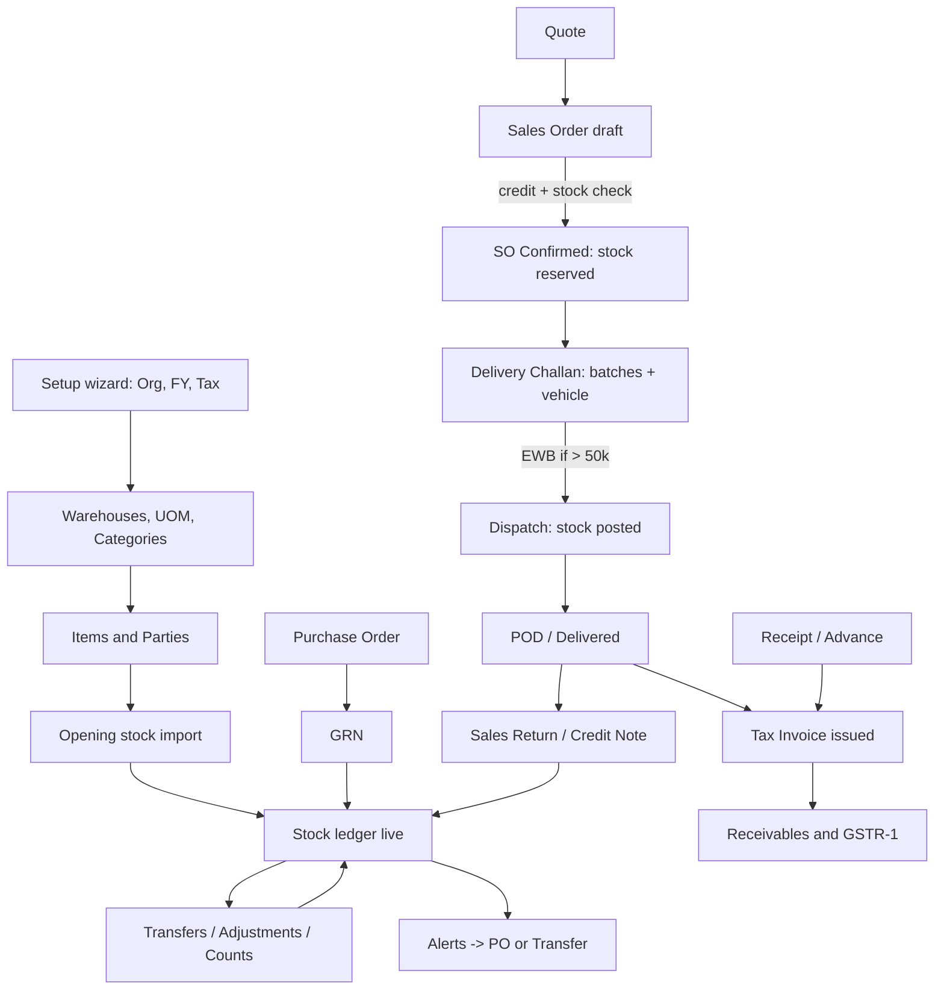

# Girder: End-to-End Design Spec

Building materials and inventory management for multi-godown traders (India, GST). Stack: React (Lovable) + Node.js/Express + MySQL 8. REST under `/api/v1`, JWT auth.

---

## 0. Foundations

### 0.1 Roles and permissions

| Role | Can do |
| --- | --- |
| Owner | Everything, credit-limit override, negative-stock override, cancel posted docs, settings, users |
| Manager | Masters, SO/DC/Invoice, transfers, adjustments (approve), reports. No users/settings |
| Storekeeper | Assigned godowns only: GRN, transfers, adjustments (draft), counts, challan dispatch |
| Sales | Parties, quotes, SOs, view stock. No stock posting |
| Accountant | Invoices, receipts, reports, GSTR-1. Read-only stock |
| Driver | Mobile only: assigned challans, POD upload |

Rules: every route is guarded by role and godown scope. Buttons the role cannot use are hidden, not disabled. Every posted document stores `created_by`, `posted_by`, timestamps.

### 0.2 Document lifecycle (all documents)

`Draft -> Confirmed/Posted -> (Cancelled | Reversed)`. Drafts are editable and auto-saved every 10 s. Posted documents are immutable. Corrections go through reversal or a new document (credit note, return, adjustment).

### 0.3 Numbering

Format `{PREFIX}/{FY}/{5-digit}`, e.g. `SO/26-27/00042`. Prefixes: SO, DC, INV, RCT, GRN, XFR, ADJ, CNT, CN (credit note), SR (sales return), PO. Counter per org, prefix and FY, stored in `doc_counters`, locked with `SELECT ... FOR UPDATE` inside the posting transaction. Invoices must be gapless (GST Rule 46). Drafts get a temporary ID and the number is assigned on confirm or issue.

### 0.3 Global shell

Sidebar (Overview, Sales, Inventory, Masters, Warehouse, Operations), top bar (Org switcher, Godown switcher, global search `/`, notifications, help), user menu (profile, change password, logout). Shortcuts: `Ctrl+N` new, `Ctrl+S` save, `Ctrl+Enter` confirm, `/` search, `Esc` close.

### 0.4 Common UI patterns

- **List screen:** search, filter chips, sort, column picker, cursor pagination (50), row click opens detail, Export CSV, Save view.
- **Detail screen:** header (number, status badge), action bar, tabs, activity timeline, related documents, attachments.
- **Form screen:** sticky action bar, inline validation, unsaved-changes guard, autosave for drafts.
- Every screen has loading, empty, and error states. Destructive actions use a confirm dialog with a reason field.

---

## 1. Module A: Masters Configuration

**Setup order (first-run wizard):** Organisation -> Financial year -> Tax settings -> Warehouses -> UOMs -> Categories/Brands -> Items -> Parties -> Opening stock import -> Users.

### A1. Organisation and settings

Screens: `Settings > Organisation`, `Settings > Financial year`, `Settings > Tax`, `Settings > Document numbering`, `Settings > Print profiles`, `Settings > Integrations (e-way bill GSP)`, `Settings > Reason codes`.

| Form | Fields | Validation |
| --- | --- | --- |
| Organisation | Legal name, trade name, GSTIN, PAN, address, state (code), phone, email, logo, bank details, invoice terms, jurisdiction | GSTIN regex + checksum; state auto-derived from GSTIN first 2 digits |
| Financial year | Name, start, end, status (open/closed) | One open FY. Closing locks postings before end date |
| Tax settings | Composition scheme (Y/N), e-invoice threshold, e-way bill threshold (default 50,000), round-off rule, reverse charge default |  |
| Numbering series | Doc type, prefix, FY, start number, padding, reset per FY | Invoice series cannot be edited once used |
| Reason codes | Type (adjustment, return, override, cancellation), code, label, active | Used in dropdowns across modules |
| GSP integration | Provider, username, client id, secret, sandbox/live toggle | Secrets stored encrypted, never returned by API |

### A2. Users and roles

Screens: `Users list -> User form`, `Role matrix (read-only view)`. Fields: name, mobile, email, password (set by invite link), role, allowed godowns (multi), active. Flow: Owner invites -> email/SMS link -> user sets password -> first login. Deactivate rather than delete. Force logout on role change.

### A3. Units of measure

Screens: `UOM list -> UOM form`. Fields: code (BAG, MT, KG, SHEET, CFT, NOS, TRUCK), name, category (weight, count, length, volume), decimal places. **Conversion** is per item (A5 Units tab): alternate UOM, formula (linear factor to base unit), rounding. Example: 1 MT = 20 BAG, 1 TRUCK = 300 BAG. All stock is stored in the base unit; transactions may use any listed UOM and are converted on save.

### A4. Categories, brands, HSN

Screens: `Categories (tree) -> form`, `Brands list -> form`, `HSN/Tax rates list -> form`. Fields: Category (name, parent, default HSN, default GST). Brand (name, active). HSN (code 4/6/8 digits, description, GST rate 0/5/12/18/28, cess %, effective from). Rate changes are date-effective; documents pick the rate by document date.

### A5. Items

Screens: `Items list -> Item detail (tabs) -> Item form`, `Bulk import`. **Item list:** filters (category, brand, godown, tracking type, low stock, inactive), columns (SKU, name, on hand, free, valuation, status).

**Item form tabs**

| Tab | Fields |
| --- | --- |
| General | SKU (unique), name, description, category, brand, item type (stock / service), barcode, image, status |
| Tax | HSN, GST % (inherits, overridable), cess, tax-inclusive price flag |
| Units | Base UOM, alternate UOMs with factors, default sales UOM, default purchase UOM |
| Tracking | None / Batch / Heat-lot / Serial; expiry tracked (Y/N); shelf life days; issue method FIFO / FEFO / manual |
| Pricing | Purchase price, MRP, default sale rate, min sale price, price list entries |
| Per godown | For each godown: reorder point, max level, bin/location default, negative stock allowed (Y/N) |
| Batches | Read-only list (see C3) |
| History | Stock ledger link, price history, audit log |

Validation: SKU unique per org; base UOM immutable once stock exists; tracking type immutable once stock exists; HSN required for stock items; min sale price \<= default sale rate. Actions: Save, Duplicate, Deactivate (blocked if on-hand > 0 or open reservations), View ledger.

### A6. Parties (customers, suppliers, transporters)

Screens: `Parties list -> Party detail (tabs) -> Party form`. Fields: type (customer/supplier/both/transporter), name, trade name, GSTIN (optional; "unregistered" allowed), PAN, mobile(s), email, billing address, multiple ship-to addresses/sites (name, address, pin, state, distance), credit limit, credit days / payment terms (Net 30), price list, opening balance (Dr/Cr), salesperson, status. Detail tabs: Overview (outstanding, overdue, credit headroom), Documents, Ledger (statement), Sites, Contacts. Rules: GSTIN checksum + duplicate check; state drives supply determination; trigram search index on name and mobile; blocked parties cannot be selected on new documents.

### A7. Price lists and discounts

Screens: `Price lists -> Price list form (item grid)`. Fields: name, valid from/to, tax-inclusive flag, lines (item, UOM, rate, min qty). Customer-level default discount %. Order of precedence: customer price list -> default sale rate; manual rate below min price needs Manager approval.

### A8. Transporters and vehicles

Screens: `Transporters list -> form`. Fields: name, transporter GSTIN, mobile, vehicles (number, type, capacity), drivers (name, mobile, licence).

---

## 2. Module B: Warehouse Management

### B1. Warehouses (godowns)

Screens: `Warehouses list -> Warehouse detail -> Warehouse form`. Fields: code, name, type (godown, yard, shop counter, transit), address, state, GSTIN registration (if separate), manager, allowed negative stock (Y/N, default N), default for sales (Y/N), active. Detail tabs: Overview (stock value, alerts, open docs), Locations, Stock, Users, Activity. Rules: cannot deactivate with stock > 0 or open documents. Each godown can be a separate GST place of business.

### B2. Locations (zones, racks, bins) *(optional per godown)*

Screens: `Locations tree -> Location form`. Fields: code (A-01-03), type (zone/rack/bin/yard), parent, capacity, active. Stock can optionally be tracked to bin level via `stock_ledger.location_id`. If a godown has no locations, stock is godown-level only.

### B3. Purchase and goods receipt (GRN)

Screens: `Purchase orders list -> PO form`, `GRN list -> GRN form -> GRN detail`. Flow: **PO (optional) -> GRN -> Putaway -> Supplier bill (optional)**.

| Form | Fields |
| --- | --- |
| PO | Supplier, date, expected date, godown, terms, lines (item, UOM, qty, rate, GST), status (Draft / Confirmed / Partially received / Closed / Cancelled) |
| GRN | Supplier, PO ref (optional), supplier invoice no./date, godown, vehicle no., received date, lines: item, ordered, received, accepted, rejected, UOM, rate, batch/heat no., mfg date, expiry, location, rejection reason |
| GRN totals | Taxable, GST, freight/other charges (apportioned to cost), total |

On **Post GRN**: one transaction creates stock ledger rows (`PURCHASE_IN`), creates or updates batches, recalculates weighted-average cost, updates PO received qty, writes journal entry. Rejected qty goes to a quarantine bucket (not free stock). Batch/heat number mandatory for tracked items. Cancel GRN: only if stock not yet consumed; creates reversal ledger rows.

### B4. Stock transfers (godown to godown)

Screens: `Transfers list -> Transfer form -> Transfer detail`. Fields: from godown, to godown, date, vehicle, lines (item, batch, qty), reason. Status: `Draft -> In transit -> Received (or Partially received) -> Closed`, plus `Cancelled`.

- **Dispatch** (Transfer out): deducts source stock, adds to an *in-transit* bucket, generates e-way bill if value > threshold and the godowns have different GSTINs.
- **Receive:** destination user confirms quantities per batch; shortage/damage requires reason; stock moves from transit to destination free stock.
- Shortage creates an automatic adjustment-down with reason `TRANSIT_LOSS`.

### B5. Stock adjustments

Screens: `Adjustments list -> Adjustment form -> Detail`. Fields: godown, date, reason (damage, theft, expiry write-off, found stock, correction, sample), lines (item, batch, direction up/down, qty, unit cost for up), attachments, notes. Approval: Storekeeper drafts, Manager approves if value above limit (configurable). Posting writes `ADJ_IN` / `ADJ_OUT` ledger rows.

### B6. Physical count (cycle count)

Screens: `Counts list -> Count sheet -> Variance review`. Flow: Create count (godown, scope: all / category / location, freeze option) -> sheet generated with system qty (hidden from counter optionally) -> enter counted qty (mobile friendly, barcode scan) -> variance report -> Manager approves -> auto-creates adjustment. Status: `Draft -> Counting -> Review -> Posted`.

### B7. Warehouse dashboard

Per godown: stock value, movements today, open transfers, pending GRNs, alerts, dispatches pending, expiring batches.

---

## 3. Module C: Inventory and Stock Tracking

### C1. Stock model (the single source of truth)

`stock_ledger` is **append-only**. Every movement is a row: `id, org_id, godown_id, location_id, item_id, batch_id, txn_type, doc_type, doc_id, qty_base, unit_cost, value, running_qty, created_at, created_by, reason`. Txn types: `OPENING, PURCHASE_IN, SALES_RETURN_IN, TRANSFER_OUT, TRANSFER_IN, DC_ISSUE, DC_REVERSE, ADJ_IN, ADJ_OUT, COUNT_ADJ, PURCHASE_RETURN_OUT`. Balances table `stock_balances(godown, item, batch)` holds `on_hand`, `reserved`, `in_transit`, `quarantine`. **Free = on_hand - reserved.** Updated in the same transaction as the ledger insert. A DB CHECK (or trigger) blocks `on_hand < 0` unless the godown allows negative stock.

**Stock is reserved** when an SO is confirmed, **reduced** when a challan is dispatched, never when an invoice is issued (invoice converts delivered challans).

### C2. Valuation

Weighted average cost per item per godown (default), recalculated on every inward. Outward at current average. FIFO layer costing optional by item setting. Valuation report by godown, category, brand, as-on date.

### C3. Batches

Screens: `Item > Batches tab`, `Batch detail`. Batch fields: batch/heat no., godown, mfg date, expiry date, age (days), on hand, reserved, free, unit cost, supplier, GRN ref, status (Active, Near expiry, Expired, Over-aged, Quarantine, Blocked). Rules: FIFO (by mfg/receipt date) or FEFO (by expiry) suggestion. Expired and over-aged batches excluded from suggestions but pickable manually with a reason. Near-expiry window and over-age days configurable (defaults 45 and 180).

### C4. Stock ledger screen

Filters: item, godown, batch, txn type, date range, document no. Columns: date/time, document (link), item, batch, type, in, out, running balance, unit cost, value, user. Export CSV. Clicking the document opens it. Opening balance row shown at top for the range.

### C5. Stock summary and reports

| Report | Description |
| --- | --- |
| Stock summary | Item x godown: on hand, reserved, free, in transit, value |
| Stock as-on date | Point-in-time from ledger |
| Item movement | Opening, in, out, closing for period |
| Batch ageing | Age buckets 0-30/31-90/91-180/180+ |
| Expiry report | Batches expiring within N days |
| Dead / slow moving | No movement in N days |
| Valuation | By godown/category |
| Reorder report | Below reorder point with suggested PO qty |
| Reservation report | Which SOs hold which stock |

### C6. Alerts engine

Scheduled job every 4 hours (node-cron) writes to `alerts`. Types: `OUT_OF_STOCK, BELOW_REORDER, NEAR_EXPIRY, OVER_AGED, NEGATIVE_STOCK, STUCK_TRANSFER`. Severity: Out of stock (free = 0), Critical (cover \< 5 days), Low (below reorder). Cover = free qty / 30-day average daily issue. Screens: `Alerts` (grouped by godown, tabs per type, value at risk, Acknowledge / Acknowledge all, "Create PO / Transfer" shortcut). Bell icon shows unacknowledged count. Optional email/WhatsApp digest.

### C7. Reservations

Screen: `Reservations` (read-only) plus a panel in item detail. Releasing: SO cancel, line removal, or expiry of hold (configurable hold days, default none). Manager can manually release with reason.

---

## 4. Module D: Sales

### D1. Quotation *(optional)*

`Quotes list -> Quote form -> Convert to SO`. Fields as SO plus validity date. Status: Draft, Sent, Accepted, Expired, Lost.

### D2. Sales order

Screens: `Sales orders list -> SO editor -> SO detail`.

**Header fields:** customer (typeahead), GSTIN (auto), order date, ship-to site, godown (default from top bar), payment terms, salesperson, delivery date, customer PO ref, notes. **Line grid:** item (typeahead showing on-hand / free), SKU/HSN (auto), godown (per line allowed), qty, UOM, rate, discount %, GST %, taxable, amount. Keyboard: Tab next field, Enter new line, Ctrl+D duplicate. **Totals panel:** gross, discount, taxable, CGST/SGST or IGST, round-off, order value. **Supply determination box:** place of supply vs supplier state -> intra-state (CGST+SGST) or inter-state (IGST). Recomputed when ship-to changes. **Credit check box:** limit, outstanding, this order, headroom. If headroom \< 0, "Confirm" requires an Owner override with reason. **Stock check:** each line shows free stock. Insufficient free stock gives a warning; options: reduce qty, pick another godown, confirm anyway as backorder (Manager+), or create PO/transfer.

**Statuses:** `Draft -> Confirmed (stock held) -> Partially delivered -> Delivered -> Invoiced -> Closed`, plus `Cancelled`, `On hold (credit)`. **Actions by status**

| Status | Allowed actions |
| --- | --- |
| Draft | Edit, Save, Discard, Confirm & hold stock |
| Confirmed | Create challan, Edit (non-posted qty only, re-checks stock/credit), Cancel (releases stock), Amend |
| Partially delivered | Create challan, Close short (with reason), Invoice delivered |
| Delivered | Create invoice |
| Invoiced / Closed | View, print, create sales return |

**Confirm transaction:** validates credit and stock -> assigns SO number -> writes `reserved` per line/godown/batch-agnostic (batches chosen at challan) -> status Confirmed.

### D3. Delivery challan (dispatch)

Screens: `Challans list -> New challan wizard -> Challan detail`.

**Wizard (5 steps)**

1. **Pick sales order:** list of Confirmed/Partially delivered SOs for the godown (or arrive from SO > "Create challan").
2. **Select lines:** per line, ordered / already sent / this challan qty / pending after. Lines from other godowns shown greyed and excluded.
3. **Allocate batches:** FIFO/FEFO suggestion auto-fills; user may override with a mandatory reason (written to the ledger entry). Shows batch age, free qty.
4. **Vehicle and driver:** vehicle no., transporter (typeahead from master), driver, mobile, distance (km), lorry receipt no.
5. **Dispatch:** summary, e-way bill panel, "Dispatch & post stock".

**E-way bill:** consignment value > threshold -> mandatory. Generated via GSP on dispatch with an **idempotency key** (`dc-{id}-ewb`), one EWB per challan. Validity = 1 day per 200 km. Detail screen actions: Extend validity, Update Part-B (vehicle change), Cancel (within 24 h if not verified), Print. **On dispatch (one DB transaction):** ledger `DC_ISSUE` rows per batch, `reserved` decrement, `on_hand` decrement, challan -> In transit, SO delivered qty updated, EWB stored. **Detail screen:** status timeline (Draft, Stock posted, EWB generated, Vehicle departed, POD received, Invoiced), consignment table, EWB card, POD panel, Print gate pass (80 mm), Mark delivered. **POD:** driver app uploads signature and photos (offline queue, replayed with idempotency key). Office can also "Mark delivered" manually with remarks. Delivered -> Invoice-eligible. **Cancel challan:** allowed before delivery; reverses stock (`DC_REVERSE`), restores reservation, cancels EWB.

### D4. Tax invoice

Screens: `Invoices list -> Convert challans to invoice -> Invoice detail`. Flow: pick customer -> list of delivered, un-invoiced challans -> tick one or more -> select advances to apply (oldest first) -> tax summary by rate -> Preview -> Issue. **Issue transaction:** lock `doc_counters` row, assign gapless number, post sales journal (Dr Customer, Cr Sales, Cr GST), write receipt allocations for applied advances, link challans to invoice, mark SO lines invoiced. Optional e-invoice IRN call if turnover requires. Statuses: `Draft, Issued, Partially paid, Paid, Overdue, Cancelled`. Overdue computed from due date. Cancel invoice: only same-period, no payments, with reason; issues a credit note otherwise.

### D5. Receipts and advances

Screens: `Receipts list -> Receipt form -> Detail`. Fields: customer, date, mode (cash/cheque/NEFT/UPI), reference/cheque no./bank, amount, godown, type (Advance against SO / Against invoice / On account), allocation grid (invoice, due, apply), notes. Rules: advance receipts record advance-tax liability for the month received; applying them to an invoice reverses it. Cheque status (Received, Deposited, Cleared, Bounced). Unallocated balance stays on account.

### D6. Returns and credit notes

Screens: `Sales returns list -> Return form`, `Credit notes list -> detail`. Return form: original invoice/challan, lines (item, batch, qty returned, condition: good/damaged), reason. Good stock goes back to free stock (`SALES_RETURN_IN`), damaged to quarantine. Credit note numbered gaplessly, reduces receivable, flows to GSTR-1 as CDNR.

### D7. Customer outstanding and collections

Screens: `Receivables` (ageing 0-30/31-60/61-90/90+), `Customer statement`, overdue list with "Send reminder" (SMS/WhatsApp/email template).

### D8. Print and share

Profiles: **A** 80 mm thermal (32-char grid, ESC/POS bytes, Bluetooth from driver app), **B** A4 tax invoice (server-rendered PDF stored in object storage, no headless browser on the request path). Share via WhatsApp/email link.

### D9. Reports and GST

Sales register, challan register, pending SO report, pending delivery, customer-wise sales, item-wise sales, margin report, GSTR-1 (B2B, B2CL, B2CS, CDNR, HSN summary, doc series) export as JSON and CSV, e-way bill register.

---

## 5. Cross-cutting screens

| Screen | Purpose |
| --- | --- |
| Login / forgot password / select org | Auth |
| Dashboard | KPIs: stock value, movements today, near expiry, over-aged, low stock, out of stock; stock by godown; high-value movements; needs-attention list; sales pipeline |
| Find a document | Single search across SO, DC, INV, RCT with chips and URL-synced filters |
| Notifications | Alerts, approvals pending, EWB expiring, overdue invoices |
| Approvals inbox | Credit overrides, adjustments above limit, price below minimum, negative stock |
| Bulk import | Upload -> Map columns -> Validate -> Fix errors -> Commit (500 rows per transaction, status machine `UPLOADED, MAPPED, VALIDATED, COMMITTING, DONE, FAILED`). Templates: items, parties, opening stock, price lists |
| Audit log | Who changed what, before/after JSON, filter by entity/user/date |
| Attachments | Any document can hold files (stored in object storage) |
| 403 / 404 / offline | Standard error pages |

---

## 6. End-to-end flow



### Navigation flows (screen to screen)

| From | Action | To |
| --- | --- | --- |
| Dashboard KPI card | Click | Alerts / Stock ledger filtered |
| Dashboard "needs attention" | View | Alerts, Overdue invoices, EWB list |
| Item detail | Stock ledger / New SO / Adjust | Ledger (filtered), SO editor (item prefilled), Adjustment form |
| Alert row | Create PO / Transfer | PO form / Transfer form prefilled with shortfall |
| Party detail | New SO / Receipt / Statement | SO editor, Receipt form, Ledger |
| SO detail | Create challan | Challan wizard step 2 |
| SO detail | Invoice delivered | Invoice conversion screen |
| Challan detail | Convert to invoice | Invoice conversion (challan preselected) |
| Invoice detail | Receive payment / Credit note | Receipt form / Return form |
| Any document | Linked doc chip | That document's detail |
| Global search | Pick result | Document or master detail |
| GRN detail | Create transfer / Print labels | Transfer form / Label print |
| Count variance | Approve | Adjustment detail |

---

## 7. MySQL data model (core tables)

`orgs, financial_years, users, roles, user_godowns, warehouses, locations, uoms, categories, brands, hsn_rates, items, item_uoms, item_godown_settings, price_lists, price_list_lines, parties, party_sites, transporters, vehicles, batches, stock_balances, stock_ledger, purchase_orders(+lines), grns(+lines), transfers(+lines), adjustments(+lines), counts(+lines), quotes(+lines), sales_orders(+lines), reservations, challans(+lines, +batch_allocations), eway_bills, pod_records, invoices(+lines), invoice_challan_links, receipts, receipt_allocations, sales_returns(+lines), credit_notes, journal_entries(+lines), alerts, doc_counters, reason_codes, import_jobs(+rows), saved_views, attachments, audit_log, idempotency_keys, notifications`.

**Key constraints**

- `stock_balances`: `CHECK (on_hand >= 0)` or trigger honouring `warehouses.allow_negative`.
- `stock_ledger`: no UPDATE/DELETE grants for the app user.
- `doc_counters`: unique `(org, doc_type, fy)`; row-locked on issue.
- `eway_bills`: unique `challan_id`; `idempotency_keys` unique key.
- Money as `DECIMAL(15,2)`, quantities `DECIMAL(15,3)`, rates `DECIMAL(15,4)`. Never FLOAT.
- Indexes: `(org, godown, item, batch)`, trigram/FULLTEXT on party name and mobile, `(org, doc_type, date)`.

---

## 8. API outline (`/api/v1`)

```
POST /auth/login, /auth/refresh, /auth/logout
CRUD /items, /parties, /warehouses, /locations, /uoms, /categories, /brands, /hsn, /price-lists, /transporters, /users
GET  /items/:id/batches, /items/:id/ledger
CRUD /purchase-orders, /grns          POST /grns/:id/post
CRUD /transfers                       POST /transfers/:id/dispatch | /receive
CRUD /adjustments                     POST /adjustments/:id/approve | /post
CRUD /counts                          POST /counts/:id/post
GET  /stock/summary, /stock/ledger, /stock/valuation, /alerts
POST /alerts/:id/acknowledge, /alerts/acknowledge-all
CRUD /sales-orders                    POST /sales-orders/:id/confirm | /cancel | /close-short
GET  /sales-orders/:id/credit-check, /stock-check
CRUD /challans                        POST /challans/:id/dispatch | /deliver | /cancel
POST /challans/:id/eway | /eway/extend | /eway/part-b | /eway/cancel   (Idempotency-Key header)
POST /challans/:id/pod                (Idempotency-Key header)
GET  /challans/:id/fifo-suggestion
POST /invoices/preview | /invoices                POST /invoices/:id/cancel
CRUD /receipts                        POST /receipts/:id/allocate
CRUD /sales-returns, /credit-notes
GET  /search?q=&docTypes=&statuses=&datePreset=&cursor=
POST /imports (upload) | /imports/:id/map | /validate | /commit
GET  /reports/gstr1 | /receivables | /stock-ageing ...
GET  /print/:docType/:id?profile=A|B
```

Conventions: Zod validation, standard error shape `{code, message, fields[]}`, cursor pagination, `If-Match` version header for optimistic locking on drafts.

---

## 9. Gap checklist (verify before build)

- [ ] Multi-godown reservation and per-line godown
- [ ] Partial delivery and partial invoicing
- [ ] Batch/heat tracking with FIFO/FEFO and override reason
- [ ] E-way bill generate / extend / Part-B / cancel with idempotency
- [ ] Gapless invoice numbering inside the posting transaction
- [ ] Advance receipts and allocation
- [ ] Intra vs inter-state tax determination
- [ ] Credit limit with Owner override
- [ ] Negative stock rule per godown enforced in DB
- [ ] Returns, credit notes, transit loss, cycle count
- [ ] Approvals inbox and audit log
- [ ] Bulk import with error fixing
- [ ] Role and godown-scoped permissions
- [ ] Offline POD from driver app
- [ ] Date-effective GST rates
- [ ] Backup, soft-delete only on masters, FY close/lock

**Out of scope for v1 (note for later):** full accounting/general ledger UI, purchase bills and payments to suppliers, multi-currency, manufacturing/BOM, loyalty/discounts schemes.

---

## 10. Lovable build order (one prompt per step)

1. Shell, auth, role guards, org/godown switchers
2. Masters: UOMs, categories, brands, HSN, warehouses, items (tabs), parties
3. Dashboard + Stock ledger + Alerts (mock API)
4. GRN, Transfers, Adjustments, Counts
5. Sales order editor with credit and stock checks
6. Challan wizard + e-way bill + POD
7. Invoice conversion + Receipts/advances
8. Returns, credit notes, receivables
9. Bulk import, Find a document, Print profiles, Reports/GSTR-1
10. Settings, Users, Approvals, Audit log

For each step tell Lovable: "Use the same `src/api/client.ts` contract; add mock data first." Then swap `VITE_API_URL` to your Express server once the matching endpoints exist.